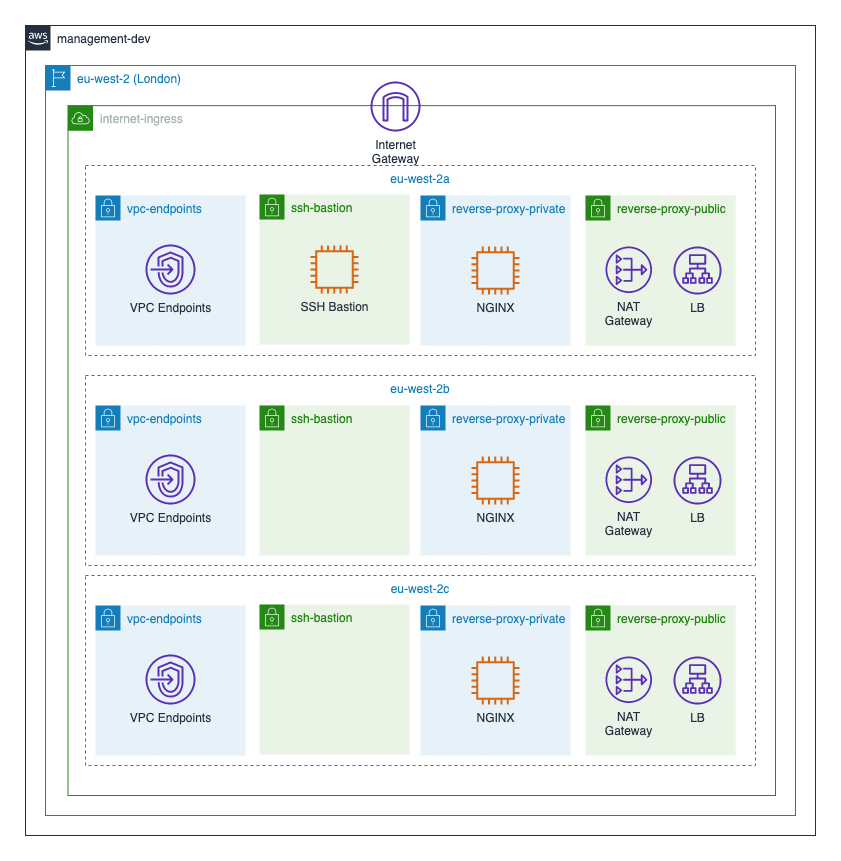
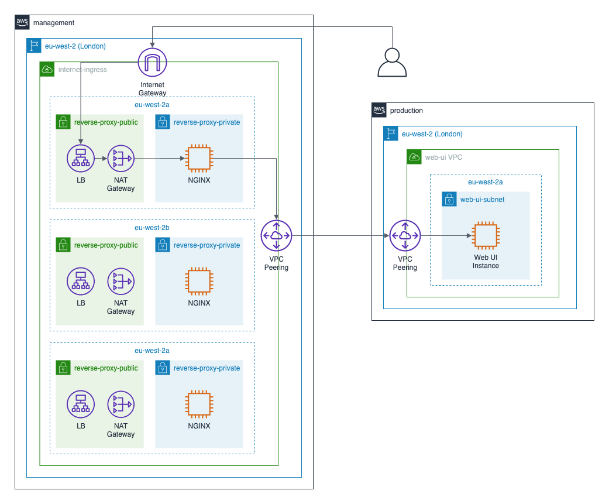

# dataworks-internet-ingress

## DataWorks AWS Internet Ingress

Provides common-good services for accessing the DataWorks environments over
the Internet.

## Overview

## Internet Reverse Proxy Service

The Internet Reverse Proxy Service provides a mechanism for accessing web user
interfaces that are hosted within private subnets.

Consumers of this service should establish network connectivity via a VPC
Peering connection as per the diagram below

## SSH Bastion Service

The SSH Bastion Service provides SSH access to EC2 instances that are hosted
within private subnets. As a rule, direct access to EC2 instances should be via
AWS Systems Manager Session Manager (SSM). However, during an IT Health Check
(ITHC) it has proved useful to allow the testers on to hosts via SSH. As such,
the deployment of this service is guarded by `ssh_bastion_enabled` in
[locals.tf](locals.tf). That setting must only be set to `true` if, and only if,
an ITHC is being performed. SSH access is restricted to certain trusted networks
via `ssh_bastion_whitelisted_ranges` in [locals.tf](locals.tf).

There is no requirement for this service to be highly available as it is used
so infrequently. In the unlikely even that the AZ hosting the SSH Bastion
instance becomes unavailable during an ITHC then it can be trivially redeployed
to a different AZ through a normal PR cycle.
